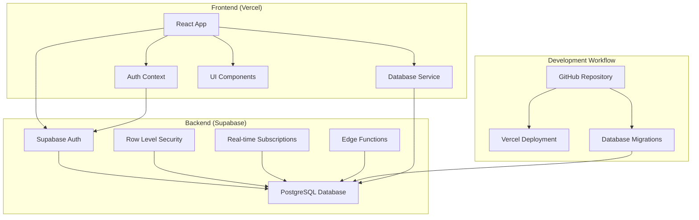
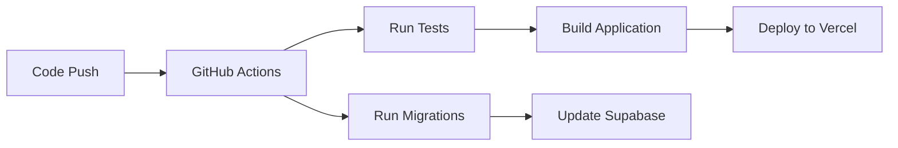

# Design Document

## Overview

This design outlines the migration of GSR Operations from a mock database implementation to a production-ready cloud hosting solution using Supabase for backend services and Vercel for frontend deployment. The migration will maintain all existing functionality while providing scalable, secure, and reliable cloud infrastructure.

## Architecture

### High-Level Architecture



### Technology Stack Migration

**Current Stack:**
- Mock database service with localStorage
- Local authentication with role-based access
- Static data with retry mechanisms

**Target Stack:**
- Supabase PostgreSQL database
- Supabase Auth with JWT tokens
- Real-time data synchronization
- Vercel edge deployment

## Components and Interfaces

### 1. Database Migration Layer

**Supabase Client Configuration:**
```typescript
interface SupabaseConfig {
  url: string;
  anonKey: string;
  serviceRoleKey?: string;
  auth: {
    autoRefreshToken: boolean;
    persistSession: boolean;
    detectSessionInUrl: boolean;
  };
}
```

**Database Service Refactor:**
- Replace `MockDatabaseClient` with Supabase client
- Maintain existing interface for `DatabaseService`
- Add real-time subscription capabilities
- Implement connection pooling and error handling

### 2. Authentication System

**Supabase Auth Integration:**
```typescript
interface AuthConfig {
  providers: ['email'];
  redirectTo: string;
  flowType: 'pkce';
}
```

**User Management:**
- Migrate from localStorage to Supabase Auth
- Implement JWT token handling
- Add refresh token rotation
- Maintain role-based authorization with RLS policies

### 3. Environment Configuration

**Environment Variables:**
```typescript
interface EnvironmentConfig {
  VITE_SUPABASE_URL: string;
  VITE_SUPABASE_ANON_KEY: string;
  SUPABASE_SERVICE_ROLE_KEY: string; // Server-side only
  VITE_APP_ENV: 'development' | 'staging' | 'production';
}
```

### 4. Migration Scripts

**Database Schema Migration:**
- Convert existing migration files to Supabase format
- Add Row Level Security (RLS) policies
- Create database functions for complex queries
- Set up real-time publication rules

## Data Models

### 1. User Authentication

**Supabase Auth Schema:**
```sql
-- Users table (managed by Supabase Auth)
-- Custom user profiles table
CREATE TABLE user_profiles (
  id UUID REFERENCES auth.users(id) PRIMARY KEY,
  role user_role NOT NULL DEFAULT 'viewer',
  name TEXT,
  active BOOLEAN DEFAULT true,
  created_at TIMESTAMP WITH TIME ZONE DEFAULT NOW(),
  updated_at TIMESTAMP WITH TIME ZONE DEFAULT NOW()
);
```

**Row Level Security Policies:**
```sql
-- Users can only read their own profile
CREATE POLICY "Users can view own profile" ON user_profiles
  FOR SELECT USING (auth.uid() = id);

-- Only admins can update user roles
CREATE POLICY "Admins can update user roles" ON user_profiles
  FOR UPDATE USING (
    EXISTS (
      SELECT 1 FROM user_profiles 
      WHERE id = auth.uid() AND role = 'admin'
    )
  );
```

### 2. Business Entity Tables

**Existing Tables Migration:**
- All current entities will be migrated to Supabase
- Foreign key relationships maintained
- Indexes optimized for query performance
- Triggers for audit trails and updated_at fields

**Real-time Subscriptions:**
```typescript
interface RealtimeConfig {
  tables: {
    orders: ['INSERT', 'UPDATE'];
    production_batches: ['INSERT', 'UPDATE'];
    invoices: ['INSERT', 'UPDATE', 'DELETE'];
  };
}
```

## Error Handling

### 1. Connection Management

**Retry Strategy:**
```typescript
interface RetryConfig {
  maxRetries: 3;
  backoffMultiplier: 2;
  initialDelay: 1000;
  maxDelay: 10000;
}
```

**Error Types:**
- Network connectivity errors
- Authentication token expiration
- Database constraint violations
- Rate limiting responses

### 2. Offline Handling

**Offline Strategy:**
- Cache critical data in IndexedDB
- Queue mutations for when connection restored
- Show offline indicators in UI
- Graceful degradation of features

### 3. Error Boundaries

**React Error Boundaries:**
- Database connection failures
- Authentication errors
- Component rendering errors
- Network timeout handling

## Testing Strategy

### 1. Database Testing

**Test Database Setup:**
- Separate Supabase project for testing
- Automated schema migrations in CI/CD
- Test data seeding scripts
- Cleanup procedures between tests

**Integration Tests:**
```typescript
interface DatabaseTestSuite {
  connectionTests: string[];
  authenticationTests: string[];
  crudOperationTests: string[];
  realtimeTests: string[];
}
```

### 2. Authentication Testing

**Auth Test Scenarios:**
- User registration and login flows
- Token refresh mechanisms
- Role-based access control
- Session persistence across browser restarts

### 3. Deployment Testing

**Vercel Preview Deployments:**
- Automatic preview deployments for PRs
- Environment variable validation
- Build process verification
- Performance testing on edge network

## Security Considerations

### 1. Row Level Security (RLS)

**Policy Implementation:**
```sql
-- Example: Users can only access their organization's data
CREATE POLICY "Organization data access" ON orders
  FOR ALL USING (
    customer_id IN (
      SELECT id FROM customers 
      WHERE organization_id = get_user_organization()
    )
  );
```

### 2. API Security

**Supabase Security Features:**
- JWT token validation
- Rate limiting on API endpoints
- SQL injection prevention
- CORS configuration

### 3. Environment Security

**Secret Management:**
- Environment variables in Vercel
- Service role keys secured
- Database connection encryption
- API key rotation procedures

## Performance Optimization

### 1. Database Performance

**Query Optimization:**
- Proper indexing strategy
- Query result caching
- Connection pooling
- Prepared statements

**Real-time Performance:**
- Selective real-time subscriptions
- Efficient change detection
- Bandwidth optimization
- Connection management

### 2. Frontend Performance

**Vercel Edge Optimization:**
- Static asset caching
- Edge function deployment
- Image optimization
- Bundle size optimization

**React Performance:**
- Component memoization
- Lazy loading of routes
- Virtual scrolling for large lists
- Optimistic updates

## Deployment Pipeline

### 1. CI/CD Workflow



### 2. Environment Management

**Development Environment:**
- Local Supabase instance or development project
- Hot reloading with Vite
- Mock data seeding

**Staging Environment:**
- Separate Supabase project
- Production-like data
- Preview deployments

**Production Environment:**
- Production Supabase project
- Custom domain configuration
- Monitoring and alerting

### 3. Migration Strategy

**Phased Rollout:**
1. **Phase 1:** Database migration and testing
2. **Phase 2:** Authentication system migration
3. **Phase 3:** Feature-by-feature migration
4. **Phase 4:** Full production deployment

**Rollback Plan:**
- Database backup before migration
- Feature flags for gradual rollout
- Quick rollback procedures
- Data consistency verification

## Monitoring and Observability

### 1. Application Monitoring

**Vercel Analytics:**
- Performance metrics
- Error tracking
- User analytics
- Core Web Vitals

**Supabase Monitoring:**
- Database performance
- API usage metrics
- Authentication events
- Real-time connection stats

### 2. Alerting

**Critical Alerts:**
- Database connection failures
- Authentication service downtime
- High error rates
- Performance degradation

### 3. Logging

**Structured Logging:**
- Application errors
- Database queries
- Authentication events
- User actions audit trail

## Migration Checklist

### Pre-Migration
- [ ] Set up Supabase projects (dev, staging, prod)
- [ ] Configure Vercel deployment pipeline
- [ ] Create database migration scripts
- [ ] Set up environment variables
- [ ] Implement authentication migration

### Migration Execution
- [ ] Run database migrations
- [ ] Deploy updated application code
- [ ] Migrate user authentication data
- [ ] Verify all functionality
- [ ] Performance testing

### Post-Migration
- [ ] Monitor application performance
- [ ] Verify data integrity
- [ ] Update documentation
- [ ] Train team on new deployment process
- [ ] Set up monitoring and alerting